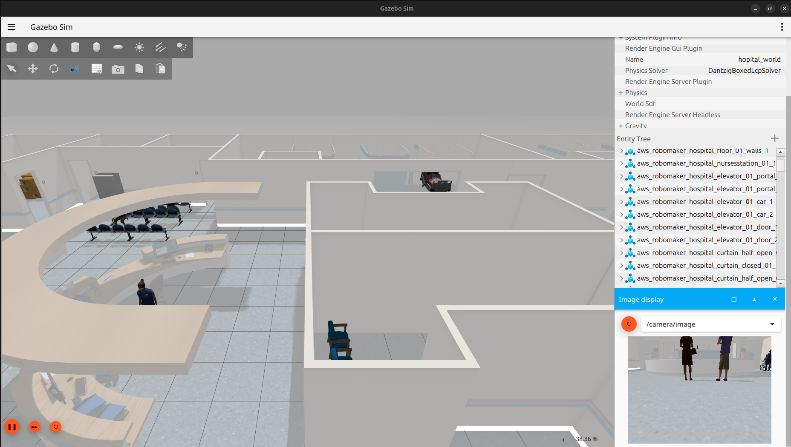
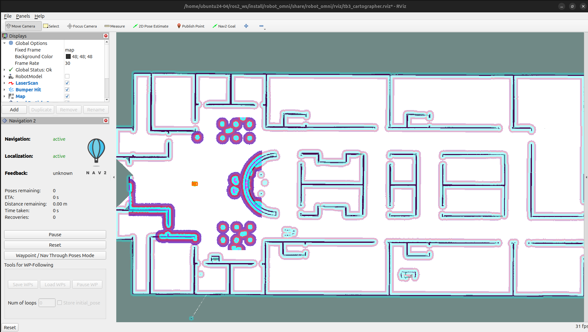
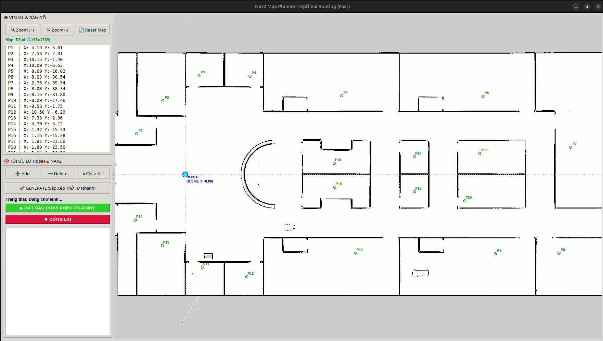

Nguyen Phuong Duy - 23134010, 
Doan Hai Dang - 23134010, 
Pham Van De - 23134012, 
Pham Nguyen Van Dong - 23134013 

# Điều Hướng Robot với ROS 2 Jazzy & Gazebo Harmonic

[](https://docs.ros.org/en/jazzy/index.html)
[](https://gazebosim.org/home)
[](https://navigation.ros.org/)
[](https://www.python.org/)

Dự án này cung cấp một hệ thống mô phỏng toàn diện cho robot di chuyển đa hướng (Mecanum) hoạt động trong môi trường bệnh viện. Tích hợp đầy đủ hệ sinh thái **ROS 2 Jazzy**, **Gazebo Harmonic**, và **Nav2** để thực hiện các tác vụ mapping, localization và autonomous navigation (kèm GUI điều khiển).

---

## Tính Năng Nổi Bật

* **Robot Đa Hướng (Mecanum):** Sử dụng `mecanum_drive_controller` điều khiển 4 bánh độc lập, cho phép di chuyển mượt mà trong không gian hẹp.
* **Môi Trường Bệnh Viện:** Mô phỏng thực tế với thế giới `hospital_full_exam.world` đầy đủ vật cản, giường bệnh và hành lang.
* **Nav2 & Cảm Biến Tiên Tiến:** Tích hợp AMCL để định vị chính xác. Costmap kết hợp dữ liệu từ Lidar (`/scan_front`) và RGBD Camera (chuyển đổi Depth sang PointCloud2).
* **Smart Navigation:** Tích hợp `velocity_smoother`, Behavior Tree tùy chỉnh (`smart_recovery_bt.xml`) giúp robot thoát hiểm thông minh, và node `waypoint_follower` bám sát lộ trình.
* **Giao Diện Điều Khiển (GUI):** Đi kèm ROS 2 Action Client GUI (`waypoint_gui.py`) để dễ dàng lên lịch trình các trạm (waypoints) cho robot.
* **Tối Ưu Dữ Liệu:** Sử dụng bộ lọc Laser (`laser_filters`) để làm sạch nhiễu cảm biến trước khi đưa vào Nav2.

---

## Hình Ảnh Dự Án

<p align="center">
  
  
</p>
<p align="center">
  <em>Trái: Môi trường Bệnh viện mô phỏng trong Gazebo Harmonic. Phải: Giao diện định vị (AMCL) và Costmap trên RViz2.</em>
</p>

<p align="center">
  
</p>
<p align="center">
  <em>Giao diện người dùng (GUI) điều khiển và lên lịch trình Waypoint cho robot.</em>
</p>

---

## Yêu Cầu Cài Đặt (Prerequisites)

Hãy đảm bảo hệ thống của bạn đã cài đặt các thành phần sau:
* Ubuntu 24.04
* ROS 2 Jazzy Jalisco
* Gazebo Harmonic
* Các gói phụ thuộc: `nav2_bringup`, `ros2_control`, `mecanum_drive_controller`, `robot_localization`, `depth_image_proc`, `laser_filters`.

```bash
sudo apt install ros-jazzy-navigation2 ros-jazzy-nav2-bringup ros-jazzy-ros2-control ros-jazzy-ros2-controllers ros-jazzy-robot-localization
